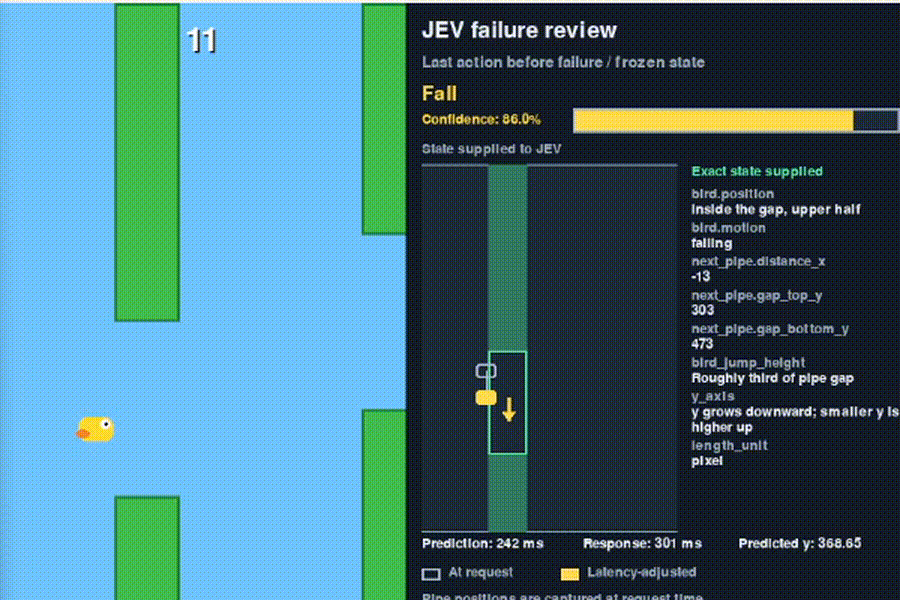

# JEV Bird

[](demo-vid.mp4)

## Features

- Deterministic game rules separated from rendering and API access.
- Asynchronous decisions on a dedicated event-loop thread.
- Latency-adjusted position and velocity predictions.
- Automatic restart after collisions.
- Frozen failure review with request state, action, confidence, and timing.
- Headless tests that do not need API credentials or a display.

## Requirements

- Python 3.10 or newer.
- A TypeSafe API key for live play.

## Quick start

Create a virtual environment and install the project:

```shell
python -m venv .venv
python -m pip install -e .
```

Activate the environment if your shell requires it, then expose the API key.
For PowerShell:

```powershell
$env:TYPESAFE_API_KEY = "your-api-key"
```

For macOS or Linux:

```shell
export TYPESAFE_API_KEY="your-api-key"
```

Run the game with either command:

```shell
python -m jev_bird
jev-bird
```

Press <kbd>Space</kbd> to pause or
resume. Closing the window cancels outstanding requests and shuts down the
background event loop.

## How decisions work

The controller requests an action every 50 ms while fewer than 12 requests are
buffered. Each request carries a semantic game state:

```json
{
  "bird": {
    "position": "inside the gap, upper half",
    "motion": "rising"
  },
  "next_pipe": {
    "distance_x": "120",
    "gap_top_y": "180",
    "gap_bottom_y": "350"
  },
  "bird_jump_height": "Roughly third of pipe gap",
  "y_axis": "y grows downward; smaller y is higher up",
  "length_unit": "pixel"
}
```

The initial response-time estimate is 250 ms. After each successful response,
the controller updates a cumulative mean and predicts the bird at the expected
application time:

```text
predicted_y = y + velocity_y × delay + 0.5 × gravity × delay²
predicted_velocity_y = velocity_y + gravity × delay
```

Early responses wait until their predicted application time. Late responses
are applied immediately, in submission order. A jump invalidates all other
buffered predictions, so the controller cancels them and requests a fresh
decision from the post-jump state. Failed, cancelled, and discarded requests
do not affect the latency average.

## Project structure

| Path | Responsibility |
| --- | --- |
| `jev_bird/game.py` | Physics, collision rules, scoring, and state capture |
| `jev_bird/controller.py` | Request buffering, action timing, and restarts |
| `jev_bird/decisions.py` | Typed payloads and immutable decision snapshots |
| `jev_bird/jev.py` | TypeSafe adapter and background asyncio lifecycle |
| `jev_bird/gameplay_viewer.py` | Live Pygame rendering |
| `jev_bird/decision_viewer.py` | Frozen failure-review rendering |
| `jev_bird/main.py` | Window, events, timing, and application lifecycle |
| `tests/` | Headless unit and integration tests |

The game and controller do not depend on the API adapter or either viewer. A
local provider can implement `get_action(state)` and return a
`concurrent.futures.Future`, which keeps simulations and most tests offline.